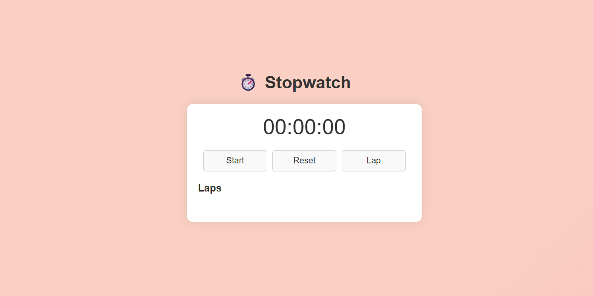

<h2 align="center">⏱️ Stopwatch Web Application</h2>



---

## 📋 Table of Contents

- [🚀 Introduction](#-introduction)
- [✨ Features](#-features)
- [🧑‍💻 Usage](#-usage)
- [🎨 UI Preview](#-ui-preview)
- [🛠 Technologies](#-technologies)
- [📄 License](#-license)
- [🌟 Show Your Support](#-show-your-support)

---

## 🚀 Introduction :-

Welcome to the **Stopwatch Web Application** — a sleek, modern, and interactive stopwatch built using **HTML**, **CSS**, and **JavaScript**.

This project is lightweight and easy to use, ideal for developers learning frontend fundamentals or users looking for a practical stopwatch tool.

---

## ✨ Features

✅ Start, pause, and reset the stopwatch  
✅ Lap tracking (up to 10 laps)  
✅ Animated gradient background for interactivity  
✅ Responsive design (mobile/tablet/desktop)  
✅ Clean and modular codebase  

---

## 🧑‍💻 Usage

To use the stopwatch:

1. Clone or download the repository:

   ```bash
   git clone https://github.com/your-username/stopwatch-app.git
   cd stopwatch-app


2. Open index.html in any web browser: 
    open  index.html


3. Use the Start, Lap, and Reset buttons as needed.

4 . Customize the UI, animations, or logic as you like!


---------------------------------------------------------------------

🛠 Technologies
HTML5

CSS3 (with media queries & animations)

Vanilla JavaScript (no frameworks)

Fully client-side


-----------------------------------------------------

🌟 Show Your Support
If this project helped you, please consider:

⭐️ Starring the repository

🔁 Forking it and building your own version

📢 Sharing it with your network


